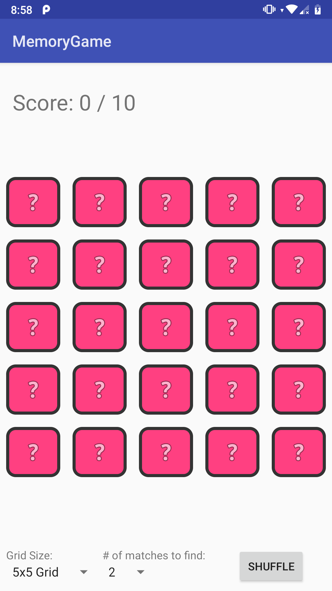
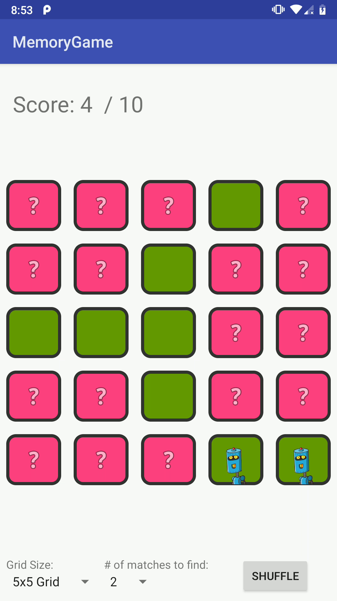
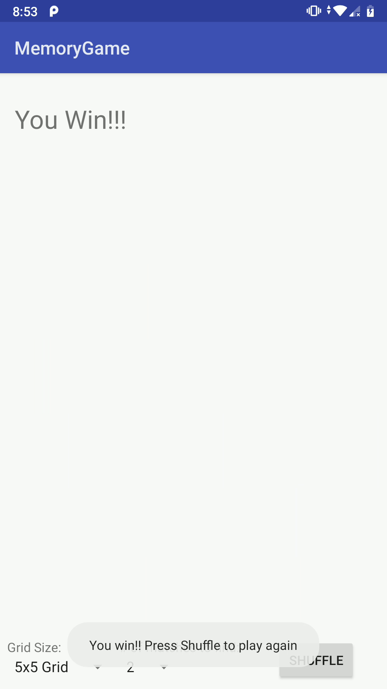
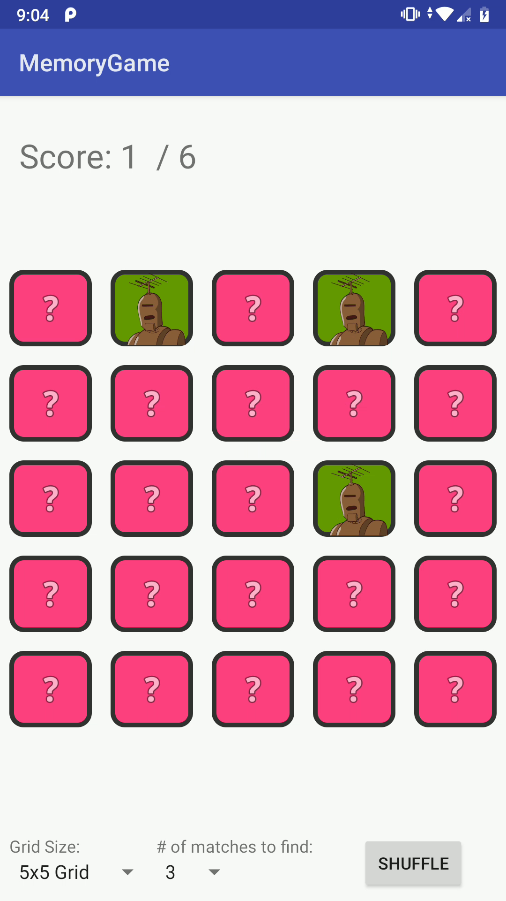
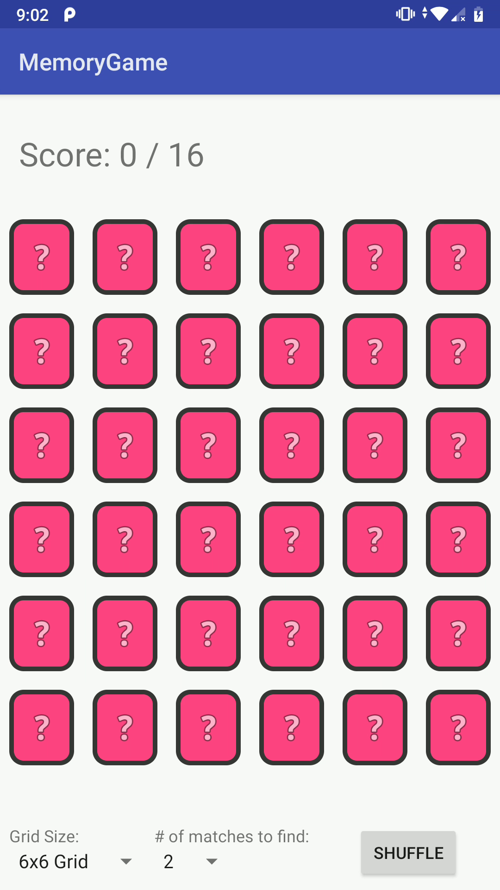
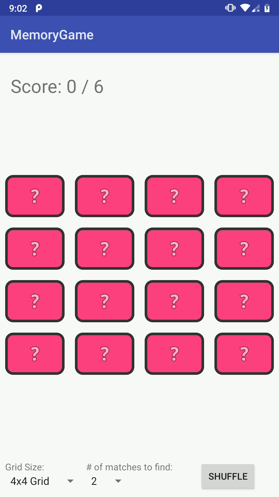

# Memory Game for Android
### Made by Manan Jadhav

Gameplay video can be seen at https://youtu.be/ciCguKa9Af4

## Screenshots

### 5x5 Grid, Match 2 cards

| No Matches | Some Matches | Game Won |
| ---------- | ------------ | -------- |
|  |  |  |

### 5x5 Grid, Match 3 cards

  

    <h5>Some Matches</h5>
    
  

### Other Grids
| 6x6 Grid | 4x4 Grid |
| ---------- | ------------ |
|  |  |

## Open Source Libraries Used

- Picasso by Square (Lazy image loading) https://square.github.io/picasso/

- OkHttp by Square (HTTP Requests) https://square.github.io/okhttp/

- Android Support Library v7 (RecyclerView) https://developer.android.com/reference/android/support/v7/widget/RecyclerView
- Android SDK v28 https://developer.android.com/studio